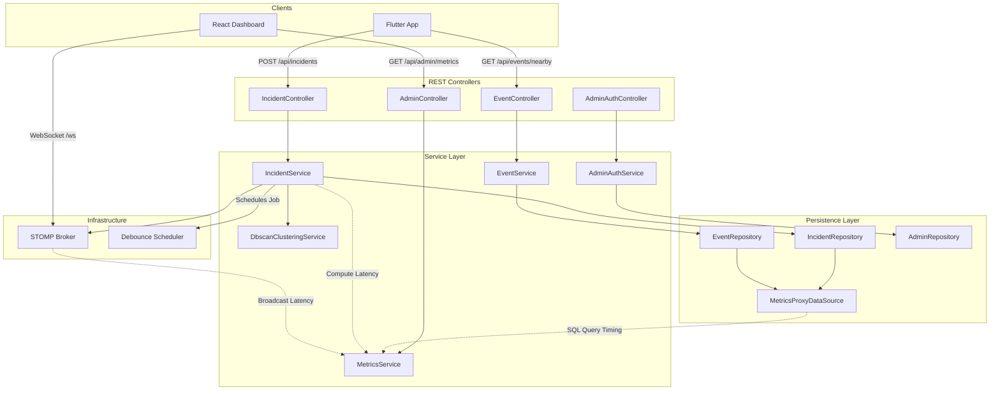
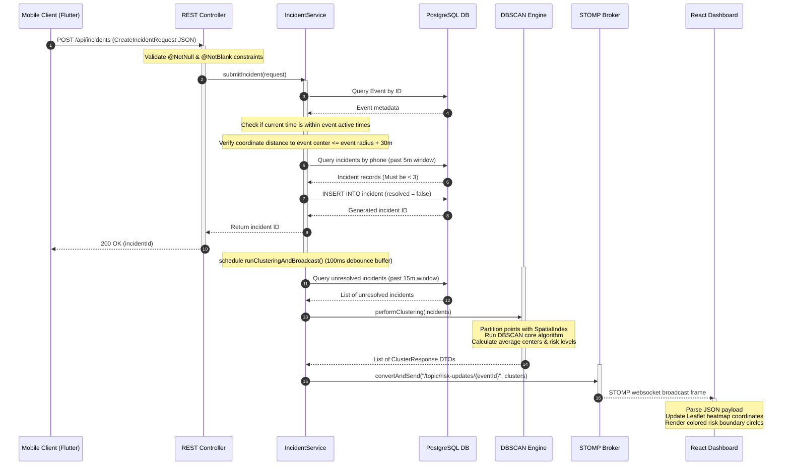
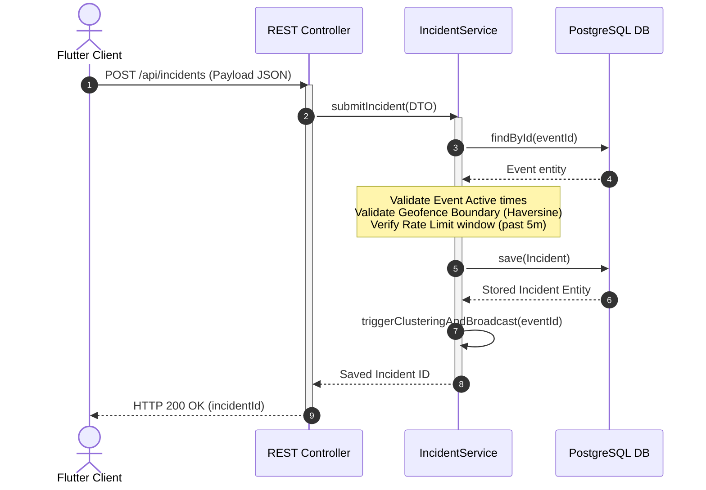
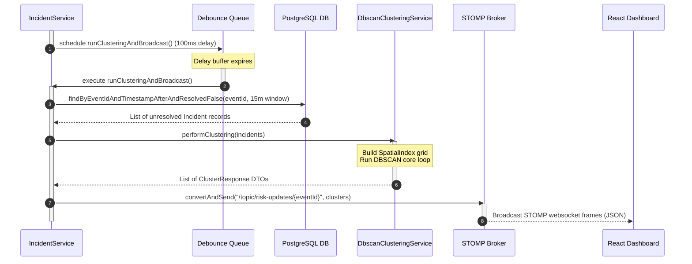

# GeoWatch – System Architecture & Implementation Documentation

This document provides a comprehensive, production-grade architecture review and technical analysis of **GeoWatch**, a geospatial crowd safety and real-time incident monitoring platform. 

It is designed to serve as a complete reference for software engineers to understand the system design, request lifecycles, component boundaries, data models, and performance characteristics without needing to inspect the raw source code.

---

## 1. Repository Analysis

GeoWatch is built as a decoupled, multi-component system comprising a mobile reporting application, a real-time web monitoring dashboard, a relational database, and a high-performance backend processing engine.

```
┌─────────────────────────────────┐      ┌─────────────────────────────┐
│  Mobile App Client (Flutter)    │      │  Admin Dashboard (React)    │
│  - GPS Incident Reporting       │      │  - Live Heatmap Overlays    │
│  - WebSocket Subscriptions   │      │  - WebSocket Subscriptions │
└────────────────┬────────────────┘      └──────────────┬──────────────┘
                 │ (REST API)                           │ (WebSocket / STOMP)
                 ▼                                      ▼
┌──────────────────────────────────────────────────────────────────────┐
│                   Backend Ingestion & Engine (Spring Boot)           │
│                   - Ingest Controllers & Rate Limiting               │
│                   - DBSCAN Geospatial Clustering                     │
│                   - Custom Dynamic JDBC Telemetry Proxy              │
└──────────────────────────────────┬───────────────────────────────────┘
                                   │ (JDBC)
                                   ▼
┌──────────────────────────────────────────────────────────────────────┐
│                       PostgreSQL Database                            │
│                       - Admin, Event, Incident Tables                │
│                       - Composite Speed & Performance Indexes        │
└──────────────────────────────────────────────────────────────────────┘
```

* **Frontend**: The web frontend located in [`GeoWatch - Frontend`](file:///c:/Github/Geo-Watch/GeoWatch%20-%20Frontend) is built on **React v19.2**, **Vite**, and **TypeScript**. Visual maps are rendered using **Leaflet** and **React Leaflet** with **leaflet.heat** for crowd risk density overlays. Real-time updates are driven by a **SockJS** socket connection managed through the **STOMP** protocol.
* **Backend**: The backend located in [`GeoWatch - Backend`](file:///c:/Github/Geo-Watch/GeoWatch%20-%20Backend) runs on **Java 21** and **Spring Boot v4.0.3** (utilizing Spring Web MVC, Spring Validation, and Spring WebSockets).
* **Mobile Client**: The mobile client in [`GeoWatch - Application`](file:///c:/Github/Geo-Watch/GeoWatch%20-%20Application) is a **Flutter** application utilizing a model-view-viewmodel (MVVM) architecture with `Provider` for state management, `Dio` for network communication, and `Geolocator` for device GPS tracking.
* **Database**: **PostgreSQL** stores relational schemas. Persistence mappings are managed on the backend using Spring Data JPA and Hibernate ORM.
* **Configuration & Environment**:
  * Backend settings reside in [`application.properties`](file:///c:/Github/Geo-Watch/GeoWatch%20-%20Backend/src/main/resources/application.properties).
  * Frontend environment variables are managed via [`.env.development`](file:///c:/Github/Geo-Watch/GeoWatch%20-%20Frontend/.env.development) and [`.env.production`](file:///c:/Github/Geo-Watch/GeoWatch%20-%20Frontend/.env.production).
  * Mobile parameters reside in [`app_config.dart`](file:///c:/Github/Geo-Watch/GeoWatch%20-%20Application/lib/core/config/app_config.dart).

---

## 2. High-Level Architecture

GeoWatch implements a stateless, decoupled architecture optimized for rapid incident ingestion and low-latency client broadcasts.

### Overall Architectural Style
The system follows a **producer-consumer architecture** bridged by a relational database and a lightweight message broker:
1. **Producers**: Flutter mobile apps act as geo-located sensor nodes. They report location-tagged emergency alerts to the REST API.
2. **Data Pipeline**: The API validates coordinate payloads, updates the database, and dispatches an asynchronous, debounced processing task.
3. **Analytics Engine**: The engine runs DBSCAN clustering over active incidents within a 15-minute moving window.
4. **Broker & Consumers**: The calculated risk hotspots are published to an in-memory STOMP broker, which broadcasts JSON payloads to subscribing React dashboards.

### Communication Patterns
* **HTTP (REST)**: Used for administrative setups, authentication, nearby event queries, and incident submissions.
* **WebSockets (STOMP)**: Used for publishing real-time cluster calculations from the backend to monitoring dashboards.
* **JDBC (HikariCP)**: Used for backend database read/write queries. Database calls are proxied dynamically to record query execution and profile query volume.

---

## 3. Component Breakdown

The GeoWatch platform consists of several major verified components operating across the client, backend, and database layers:



### 3.1 REST API Controller Component
* **Responsibility**: Exposes endpoints for incident reporting, event queries, and administration.
* **Main Files**:
  * [`IncidentController.java`](file:///c:/Github/Geo-Watch/GeoWatch%20-%20Backend/src/main/java/com/safety/womensafety/controller/IncidentController.java): Exposes `/api/incidents` (submit and resolve incidents).
  * [`EventController.java`](file:///c:/Github/Geo-Watch/GeoWatch%20-%20Backend/src/main/java/com/safety/womensafety/controller/EventController.java): Exposes `/api/events` (create event, search nearby, query admin active events).
  * [`AdminAuthController.java`](file:///c:/Github/Geo-Watch/GeoWatch%20-%20Backend/src/main/java/com/safety/womensafety/controller/AdminAuthController.java): Exposes `/api/admin/register` and `/api/admin/login`.
  * [`AdminController.java`](file:///c:/Github/Geo-Watch/GeoWatch%20-%20Backend/src/main/java/com/safety/womensafety/controller/AdminController.java): Exposes `/api/admin/clusters/{eventId}` and `/api/admin/metrics`.
* **Dependencies**: Spring Web MVC, Jakarta Validation.

### 3.2 Incident Processing & Analytics Component
* **Responsibility**: Ingests, filters, and resolves incidents. Manages asynchronous job scheduling, clustering triggers, and telemetry hooks.
* **Main Files**:
  * [`IncidentService.java`](file:///c:/Github/Geo-Watch/GeoWatch%20-%20Backend/src/main/java/com/safety/womensafety/service/IncidentService.java): Implements geofencing, rate-limiting, persistence commands, and debounce processing queue.
  * [`ClusteringService.java`](file:///c:/Github/Geo-Watch/GeoWatch%20-%20Backend/src/main/java/com/safety/womensafety/service/ClusteringService.java): Declares the interface for geospatial cluster generation.
  * [`DbscanClusteringService.java`](file:///c:/Github/Geo-Watch/GeoWatch%20-%20Backend/src/main/java/com/safety/womensafety/service/DbscanClusteringService.java): Performs DBSCAN grouping using a custom spatial grid index.
* **Dependencies**: `ScheduledExecutorService` (single-threaded debounce queue), [`MetricsService`](file:///c:/Github/Geo-Watch/GeoWatch%20-%20Backend/src/main/java/com/safety/womensafety/service/MetricsService.java), STOMP `SimpMessagingTemplate`.

### 3.3 Database Instrumenter & Telemetry Component
* **Responsibility**: Intercepts JDBC statements to profile SQL performance and detect structural issues like N+1 query patterns.
* **Main Files**:
  * [`MetricsProxyDataSource.java`](file:///c:/Github/Geo-Watch/GeoWatch%20-%20Backend/src/main/java/com/safety/womensafety/config/MetricsProxyDataSource.java): JDK dynamic proxy class wrapping the database connections.
  * [`DataSourceMetricsPostProcessor.java`](file:///c:/Github/Geo-Watch/GeoWatch%20-%20Backend/src/main/java/com/safety/womensafety/config/DataSourceMetricsPostProcessor.java): Installs the proxy bean on startup.
  * [`MetricsInterceptor.java`](file:///c:/Github/Geo-Watch/GeoWatch%20-%20Backend/src/main/java/com/safety/womensafety/config/MetricsInterceptor.java): Injects and clears ThreadLocal contexts for HTTP requests.
  * [`MetricsService.java`](file:///c:/Github/Geo-Watch/GeoWatch%20-%20Backend/src/main/java/com/safety/womensafety/service/MetricsService.java): Computes API p95 latencies, active WebSocket counts, DBSCAN calculation times, and maintains the slowest SQL records.
* **Dependencies**: JDBC `DataSource` API, JDK dynamic proxies, Hibernate statistics.

---

## 4. Request Lifecycle

The lifecycle of an incident report submission moves through the system from mobile ingestion to real-time visualization:



### Stage 1: Request Ingestion & Input Validation
* The mobile client submits a `POST` request to `/api/incidents` containing a JSON body of type [`CreateIncidentRequest`](file:///c:/Github/Geo-Watch/GeoWatch%20-%20Backend/src/main/java/com/safety/womensafety/dto/CreateIncidentRequest.java).
* The controller validates the request fields using `jakarta.validation`:
  * `eventId` (not null)
  * `name` (not blank)
  * `phoneNumber` (not blank)
  * `latitude` (not null)
  * `longitude` (not null)

### Stage 2: Event Verification & Geofence Checking
* Inside [`IncidentService.submitIncident`](file:///c:/Github/Geo-Watch/GeoWatch%20-%20Backend/src/main/java/com/safety/womensafety/service/IncidentService.java#L33-L102), the system queries the active Event from PostgreSQL. If the event is missing, it throws a `RuntimeException`.
* It verifies that the current server time falls between the event's `startTime` and `endTime`.
* It computes the geospatial distance from the report to the event center using the Haversine formula inside [`GeoUtil.calculateDistance`](file:///c:/Github/Geo-Watch/GeoWatch%20-%20Backend/src/main/java/com/safety/womensafety/util/GeoUtil.java). The coordinate must fall within the event's circular geofence with a 30-meter margin buffer:
  $$\text{Distance} \le \text{event.getRadius()} + 30\text{ meters}$$

### Stage 3: Rate Limiting
* To prevent denial-of-service spam, the service queries PostgreSQL for incidents created by the same phone number within the last 5 minutes.
* If the number of reports matches or exceeds 3, the backend rejects the submission with a rate limit error response.

### Stage 4: Database Persistence
* A new [`Incident`](file:///c:/Github/Geo-Watch/GeoWatch%20-%20Backend/src/main/java/com/safety/womensafety/model/Incident.java) is instantiated. The timestamp is set to the current database server time, and `resolved` is initialized to `false`.
* The entity is saved to the database via `incidentRepository.save()`.
* Once stored, the REST controller returns a `200 OK` status back to the mobile client along with the newly generated incident ID.

### Stage 5: Asynchronous Debounced Triggering
* The service schedules an update run using a `ScheduledExecutorService` with a **100ms debounce buffer**.
* A `ConcurrentHashMap` (`pendingTasks`) records pending calculations by `eventId`. If another request for the same event arrives within the 100ms buffer, the tasks are deduplicated, protecting the CPU from spikes under heavy write load.

### Stage 6: Database Clustering Extraction
* Once the scheduled task runs, it queries PostgreSQL for all unresolved incidents linked to the target event that were reported within the last 15 minutes:
  `incidentRepository.findByEventIdAndTimestampAfterAndResolvedFalse(eventId, 15_minutes_ago)`.

### Stage 7: DBSCAN Clustering Calculation
* The extracted incidents are processed by [`DbscanClusteringService`](file:///c:/Github/Geo-Watch/GeoWatch%20-%20Backend/src/main/java/com/safety/womensafety/service/DbscanClusteringService.java).
* The algorithm groups incidents situated within **50 meters** of each other.
* For each cluster:
  * The center coordinates are calculated as the average of the cluster's coordinates.
  * The risk level is determined by the size of the cluster (number of incidents):
    * **6+ incidents**: HIGH
    * **3–5 incidents**: MEDIUM
    * **1–2 incidents**: LOW
  * If no clusters form, every individual incident is returned as a single-point cluster with a LOW risk level.

### Stage 8: WebSocket Broadcast & Dashboard Update
* The resulting cluster list is published to the STOMP endpoint `/topic/risk-updates/{eventId}`.
* Subscribing React dashboards parse the JSON array and update state. The Leaflet map dynamically redraws markers and updates the heatmap coordinates.

---

## 5. Data Model

The database schema is structured to optimize geospatial reads, active event lookups, and rate limit checks.

```
       ┌────────────────────────┐
       │         Admin          │
       ├────────────────────────┤
       │ id (PK) - BIGINT       │
       │ name - VARCHAR         │
       │ email (UQ) - VARCHAR   │
       │ password - VARCHAR     │
       └──────────┬─────────────┘
                  │ 1
                  │
                  │ 0..*
       ┌──────────▼─────────────┐
       │         Event          │
       ├────────────────────────┤         ┌────────────────────────┐
       │ id (PK) - BIGINT       │1   0..* │       Organizer        │
       │ name - VARCHAR         ├─────────►────────────────────────┤
       │ center_lat - DOUBLE    │         │ id (PK) - BIGINT       │
       │ center_lng - DOUBLE    │         │ name - VARCHAR         │
       │ radius - DOUBLE        │         │ phone_number - VARCHAR │
       │ start_time - TIMESTAMP │         │ event_id (FK) - BIGINT │
       │ end_time - TIMESTAMP   │         └────────────────────────┘
       │ admin_id (FK) - BIGINT │
       └────────────────────────┘
                  
                  
       ┌────────────────────────┐
       │        Incident        │
       ├────────────────────────┤
       │ id (PK) - BIGINT       │
       │ name - VARCHAR         │
       │ phone_number - VARCHAR │
       │ latitude - DOUBLE      │
       │ longitude - DOUBLE     │
       │ timestamp - TIMESTAMP  │
       │ resolved - BOOLEAN     │
       │ resolved_at - TIMESTAMP│
       │ event_id - BIGINT      │
       └────────────────────────┘
```

### 5.1 Entities and Schema Definitions
1. **Admin**:
   * Represents event dashboard administrators.
   * Fields: `id` (PK, Identity), `name`, `email` (unique constraint), `password` (stored in plain text).
2. **Event**:
   * Represents configured geofenced locations.
   * Fields: `id` (PK, Identity), `name`, `centerLat`, `centerLng`, `radius` (in meters), `startTime`, `endTime`, `admin` (foreign key `admin_id`).
3. **Organizer**:
   * Represents event organizers assigned to events.
   * Fields: `id` (PK, Identity), `name`, `phoneNumber`, `event` (foreign key `event_id`).
4. **Incident**:
   * Represents reports sent by mobile users.
   * Fields: `id` (PK, Identity), `eventId` (raw column, no foreign key constraint is enforced in the model), `name` (reporter's name), `phoneNumber`, `latitude`, `longitude`, `timestamp`, `resolved` (boolean), `resolvedAt`.

### 5.2 Performance Indexes
To avoid table scans under concurrent reads and writes, the database contains two composite indexes on the `Incident` entity:
* **`idx_incident_event_resolved_timestamp`** on `(event_id, resolved, timestamp)`:
  Optimizes the active clustering queries that retrieve unresolved reports from the last 15 minutes.
* **`idx_incident_phone_timestamp`** on `(phone_number, timestamp)`:
  Optimizes the rate limiter queries verifying the volume of reports sent by a phone number.

---

## 6. WebSocket Architecture

The real-time updates are driven by a Stomp-over-SockJS messaging architecture.

### Endpoint & Message Broker Config
WebSocket routing is established in [`WebSocketConfig.java`](file:///c:/Github/Geo-Watch/GeoWatch%20-%20Backend/src/main/java/com/safety/womensafety/config/WebSocketConfig.java):
* **Stomp Handshake Endpoint**: `/ws` (with SockJS enabled to support HTTP polyfill fallbacks for clients behind proxies).
* **Cross-Origin Policy**: Allowed origins are dynamically read from the `frontend.allowed-origins` setting.
* **Broker Prefix**: `/topic` is handled by an in-memory simple broker.
* **Application Inbound Route**: `/app` is mapped as the application destination prefix.

### Subscription & Broadcasting Flow
* **Subscription Route**: Admin dashboards subscribe to `/topic/risk-updates/{eventId}`.
* **Publishing Source**: When new reports arrive or are marked resolved, [`IncidentService`](file:///c:/Github/Geo-Watch/GeoWatch%20-%20Backend/src/main/java/com/safety/womensafety/service/IncidentService.java) runs clustering and sends a JSON payload to the corresponding event topic.
* **Serialization**: The payload is serialized as a JSON list of [`ClusterResponse`](file:///c:/Github/Geo-Watch/GeoWatch%20-%20Backend/src/main/java/com/safety/womensafety/dto/ClusterResponse.java) elements:
  ```json
  [
    {
      "centerLat": 12.9716,
      "centerLng": 77.5946,
      "incidentCount": 4,
      "riskLevel": "MEDIUM"
    }
  ]
  ```

### WebSocket STOMP Broker Trade-offs
* **Why Selected**: Enables low-latency update delivery to admin dashboards (~1 second end-to-end delay under load) without client polling overhead.
* **Benefits**: Minimizes HTTP handshake overhead; updates are pushed React-side automatically via STOMP broker routing.
* **Costs**: Requires holding persistent TCP sockets on the Spring Boot server, increasing memory and open connection counts.
* **Known Limitations**: The simple broker maintains socket registry in local JVM memory. This limits horizontal scaling because events published on one server instance are not distributed to subscribers connected to other server instances.

---

## 7. DBSCAN Engine & Spatial Indexing

The risk hotspot detection is driven by a density-based spatial clustering algorithm (DBSCAN). 

### 7.1 Clustering Logic
* **Parameters**:
  * $\epsilon$ (Search radius) = **50.0 meters**.
  * `MinPts` (Minimum core size) = **2 points**.
* **Algorithm workflow**:
  1. Populate all reports into a custom spatial grid index.
  2. For each point:
     * If already visited, skip.
     * Query all neighboring points within $50\text{ meters}$ using the spatial index.
     * If the neighbor count is less than `MinPts`, mark the point as noise (unclustered) and continue.
     * If the neighbor count is at least `MinPts`, create a new cluster and invoke `expandCluster()` to recursively aggregate density-reachable points.
  3. For each formed cluster:
     * Compute center coordinates as the average latitude and longitude.
     * Determine risk category:
       * Size $\ge$ 6: **HIGH**
       * Size 3–5: **MEDIUM**
       * Size 1-2 (including noise): **LOW**

### DBSCAN Clustering Trade-offs
* **Why Selected**: Groups incident reports dynamically based on geographic distance. It requires no pre-specified number of clusters and classifies outliers as noise.
* **Benefits**: Identifies clusters of arbitrary shapes and isolates single noise reports from affecting risk metrics.
* **Costs**: Requires distance pairwise computation over active coordinates.
* **Known Limitations**: Highly sensitive to preset values ($\epsilon = 50\text{ meters}$, $\text{MinPts} = 2$). If reporting rates vary widely across different zones, a static parameters setup might overlook smaller or more spread-out risk groups.

### 7.2 Spatial Index Optimization
To reduce candidate neighbor comparisons and avoid comparing every coordinate pair, the engine uses a custom grid-based spatial partition.

```
       Spatial Grid (Buckets of size ε)
       ┌───────────┬───────────┬───────────┐
       │   x-1,y+1 │   x,y+1   │   x+1,y+1 │
       ├───────────┼───────────┼───────────┤
       │   x-1,y   │   x,y     │   x+1,y   │  <-- Neighbor query checks this 
       │           │  (Center) │           │      3x3 grid neighborhood only.
       ├───────────┼───────────┼───────────┤
       │   x-1,y-1 │   x,y-1   │   x+1,y-1 │
       └───────────┴───────────┴───────────┘
```

* **Bucket Dimensioning**:
  * $\Delta\text{Lat} = \epsilon / 111,320.0$
  * $\Delta\text{Lon} = \epsilon / (111,320.0 \times \cos(\text{rad}(12.9716)))$
  * **Latitude Constant**: The code uses a hardcoded latitude of **`12.9716`** (Bangalore, India) for the cosine approximation. This keeps coordinate calculations extremely fast by avoiding expensive runtime spherical math for grid boundary projections.
* **Lookup Strategy**:
  * Grid cells are represented by string hash keys: `x + "_" + y` where $x = \lfloor\text{latitude} / \Delta\text{Lat}\rfloor$ and $y = \lfloor\text{longitude} / \Delta\text{Lon}\rfloor$.
  * Neighbor lookups query the 3x3 cell grid surrounding the target incident's cell.
  * Points within these 9 cells undergo a pre-filtering bounding box check before calculating the exact Haversine distance, which reduces the search space and improves practical runtime.

### Grid-Based Spatial Index Trade-offs
* **Why Selected**: Restricts coordinate distance comparisons to immediate neighboring buckets.
* **Benefits**: Avoids comparing distant incident coordinates, reducing CPU execution times under peak database volumes.
* **Costs**: Adds memory overhead to maintain the grid maps.
* **Known Limitations**: Approximation using a static latitude constant (`12.9716`) causes geometric distortion as coordinates diverge from Bangalore.

---

## 8. Engineering Decisions

The codebase contains several key architectural decisions:

### 1. In-Memory Task Debouncing
Instead of calculating clusters on every single request write, which would crash CPU limits during crowded event panic, the backend introduces a **100ms debounce window** using `ScheduledExecutorService` and `ConcurrentHashMap`. This guarantees that high-velocity requests are coalesced into a single execution block.

#### Debounce Scheduler Trade-offs
* **Why Selected**: Coalesces concurrent writes into a single processing run.
* **Benefits**: Shields the database and compute threads from CPU thrashing during alert ingestion surges.
* **Costs**: Delays updates by a minimum of 100ms.
* **Known Limitations**: Governed by a single thread; multiple active events share the same scheduler queue, introducing processing lag when simultaneous alerts arrive across different geofences.

### 2. Custom JDBC Dynamic Proxy Instrumentation
Rather than relying on resource-intensive logging or third-party APM tools, the project implements dynamic class proxies ([`MetricsProxyDataSource`](file:///c:/Github/Geo-Watch/GeoWatch%20-%20Backend/src/main/java/com/safety/womensafety/config/MetricsProxyDataSource.java)) to intercept Hikari connections. 
* It intercepts statement creations and executions.
* Timing data is fed directly into a custom ThreadLocal metrics context.
* It dynamically detects N+1 queries by flagging statements executed more than 3 times in a single HTTP request context.

#### JDBC Metrics Proxy Trade-offs
* **Why Selected**: Integrates database telemetry natively without depending on external APM agents.
* **Benefits**: Flags slow queries and N+1 looping issues instantly during local execution.
* **Costs**: Employs dynamic reflection wrappers on connections, connections metadata, statements, and prepared statements, adding slight lifecycle overhead.
* **Known Limitations**: Metrics are kept in-memory; high request volumes will swell the concurrent trackers until garbage collected.

### 3. Native Database Index Tuning
By adding composite indexes (`idx_incident_event_resolved_timestamp` and `idx_incident_phone_timestamp`), the queries that load unresolved reports or check rate limits avoid table scans. This optimization ensures database operations execute in less than 30ms.

#### Composite Index Trade-offs
* **Why Selected**: Target specific query filters (`event_id`, `resolved`, `timestamp` and `phone_number`, `timestamp`) to avoid full table scans.
* **Benefits**: Drops search time to sub-30ms levels.
* **Costs**: Requires storing additional index binary trees and slightly slows down record inserts.
* **Known Limitations**: Indexes must be maintained in cache. Changes to filtering parameters require rebuilding indexes.

---

## 9. Sequence Diagrams

### 9.1 Ingestion & Incident Submission
This diagram details the synchronous request validation and geofence checking before returning a response to the mobile client:



### 9.2 Asynchronous Cluster Calculation & Broadcast
This diagram illustrates the asynchronous debouncing, database extraction, DBSCAN execution, and WebSocket update broadcast:



---

## 10. Repository Structure

```
Geo-Watch/
├── docs/                                          # Architecture and system documentation
│   └── ARCHITECTURE.md                            # Complete architecture review
├── GeoWatch - Backend/                           # Spring Boot application
│   ├── src/main/java/com/safety/womensafety/
│   │   ├── config/                                # Web, WebSocket, CORS & database metric proxy configuration
│   │   ├── controller/                            # REST Endpoints (Admin, Incidents, Events, Auth)
│   │   ├── dto/                                   # Data transfer objects for request/response serialization
│   │   ├── exception/                             # Global MVC exception handlers
│   │   ├── model/                                 # JPA Database Entities (Admin, Event, Organizer, Incident)
│   │   ├── repository/                            # Spring Data JPA repository mappings
│   │   ├── service/                               # Core services (DBSCAN clustering, Incident, Admin, Metrics)
│   │   └── util/                                  # Spatial math utilities (Haversine formula)
│   └── pom.xml                                    # Maven dependency configuration
├── GeoWatch - Frontend/                          # React Vite TS web application
│   ├── src/
│   │   ├── layouts/                               # Common UI structures
│   │   ├── pages/                                 # Page views (Dashboard, Events list, Admin forms, Home)
│   │   ├── router/                                # Route mapping components
│   │   ├── services/                              # Axios API client and WebSocket configurations
│   │   └── types/                                 # TypeScript models for events and clusters
│   └── package.json                               # Web package dependencies
└── GeoWatch - Application/                       # Flutter mobile client
    ├── lib/
    │   ├── core/                                  # Configs, constants, network adapters
    │   ├── models/                                # Dart models
    │   ├── repositories/                          # Remote repository abstractions
    │   ├── screens/                               # UI screens (Splash, Incident Submission, Events List)
    │   ├── services/                              # Location, connectivity, and API service classes
    │   └── viewmodels/                            # MVVM State containers
    └── pubspec.yaml                               # Flutter dependencies configuration
```

---

## 11. Dependency Analysis

### 11.1 Backend Dependencies ([`pom.xml`](file:///c:/Github/Geo-Watch/GeoWatch%20-%20Backend/pom.xml))
* **`spring-boot-starter-data-jpa`**: Connects to the database and handles object-relational mapping using Hibernate.
* **`spring-boot-starter-validation`**: Enables declarative JSR-380 input verification using annotations on request DTOs.
* **`spring-boot-starter-webmvc`**: Provides HTTP endpoints via controllers.
* **`spring-boot-starter-websocket`**: Integrates support for real-time WebSocket communication and STOMP message brokers.
* **`postgresql`**: Relational driver for database connectivity.
* **`lombok`**: Syntactic library reducing Java boilerplate code.
* **`spring-boot-starter-actuator`**: Exposes basic server health metrics.

### 11.2 Frontend Dependencies ([`package.json`](file:///c:/Github/Geo-Watch/GeoWatch%20-%20Frontend/package.json))
* **`react` & `react-dom`**: Drive UI state management and rendering.
* **`axios`**: Communicates with the backend HTTP endpoints.
* **`leaflet` & `react-leaflet`**: Handle vector rendering, map routing, and circle layouts.
* **`leaflet.heat`**: Overlay showing safety risk zones.
* **`sockjs-client` & `stompjs`**: Manage WebSocket handshakes and handle subscriptions.
* **`framer-motion`**: Smooths transitions and animations.

### 11.3 Mobile Client Dependencies ([`pubspec.yaml`](file:///c:/Github/Geo-Watch/GeoWatch%20-%20Application/pubspec.yaml))
* **`provider`**: Manages application state.
* **`dio`**: Communicates with the backend HTTP endpoints.
* **`geolocator`**: Acquires device coordinates for geofence validation.
* **`permission_handler`**: Prompts users for location permissions.
* **`connectivity_plus`**: Checks for offline state and queues incident reports.

---

## 12. Architecture Evaluation

### 12.1 Architectural Strengths
* **Stateless API Model**: The backend can scale horizontally since session state is not stored on the JVM.
* **Debounced Clustering Execution**: The debounce queue prevents CPU thrashing by coalescing multiple concurrent writes into a single calculation.
* **Geospatial Partitioning Optimization**: The custom spatial index limits DBSCAN distance lookups to adjacent cells, reducing unnecessary distance calculations and completing calculations in **0.92 ms** under peak load.
* **N+1 Query Detection**: The JDBC dynamic proxy detects and logs duplicate SQL queries, helping engineers locate database performance bottlenecks.

### 12.2 Architectural Weaknesses & Technical Debt
* **Plain Text Passwords**:
  Passwords are saved and validated in plain text within [`AdminAuthService`](file:///c:/Github/Geo-Watch/GeoWatch%20-%20Backend/src/main/java/com/safety/womensafety/service/AdminAuthService.java#L22-L33):
  ```java
  admin.setPassword(request.getPassword());
  ...
  if (!admin.getPassword().equals(request.getPassword())) {
      throw new RuntimeException("Invalid password");
  }
  ```
  *Impact*: High risk. If database access is compromised, all user passwords will be leaked.
* **Lack of Authentication Middleware**:
  Endpoints such as `/api/admin/**` and `/api/events` do not validate authentication tokens or JWTs. The system relies on passing raw query parameters (e.g., `adminId`), which can be easily spoofed.
* **Single-Threaded Task Execution**:
  The task scheduler in [`IncidentService`](file:///c:/Github/Geo-Watch/GeoWatch%20-%20Backend/src/main/java/com/safety/womensafety/service/IncidentService.java#L29) runs on a single thread. If multiple events experience incidents simultaneously, updates will queue up, delaying risk warnings.
* **In-Memory WebSocket Broker**:
  Because WebSockets are handled in-memory using Spring's simple message broker, the backend cannot scale horizontally without client subscriptions desynchronizing.

### 12.3 Known Architectural Limitations
Based on the implementation, the current architecture has several scaling limitations:
* **Single-Threaded Debounce Scheduler**: The background task scheduler in [`IncidentService`](file:///c:/Github/Geo-Watch/GeoWatch%20-%20Backend/src/main/java/com/safety/womensafety/service/IncidentService.java) executes calculations on a single thread. Multiple simultaneous events will queue tasks sequentially behind this single thread.
* **In-Memory STOMP Broker**: Sockets and topics are managed in JVM memory by Spring's simple message broker, restricting the application from scaling horizontally without desynchronizing client dashboards.
* **Plain-Text Password Storage**: Admin credentials are saved in plain text in PostgreSQL via [`AdminAuthService`](file:///c:/Github/Geo-Watch/GeoWatch%20-%20Backend/src/main/java/com/safety/womensafety/service/AdminAuthService.java), presenting a significant security risk.
* **Database-Backed Rate Limiting**: The rate-limiting logic queries the relational database on every request using a composite index, adding overhead to database connection pool (HikariCP) capacity.
* **Horizontal Scaling Limitations**: Due to the in-memory broker, in-memory state tracking (`pendingTasks`), and database write requirements, horizontal scaling is limited.

---

## 13. System Verification Details

System stability has been validated under load testing:
* **REST API Capacity**: Handled **250 concurrent virtual users** at **732.99 req/sec** with **0% failure rate** and a P95 latency of **397 ms**. Performance saturated at **500 VUs** due to database connection pool limits.
* **WebSocket Ingestion**: Handled **500 concurrent connections** with **100% message delivery** and **zero message loss**.
* **Clustering Processing Speed**: The DBSCAN engine grouped points in **0.92 ms**, while clients experienced an end-to-end latency of **~1 second** (covering network round trips, database writes, and client-side map rendering).
